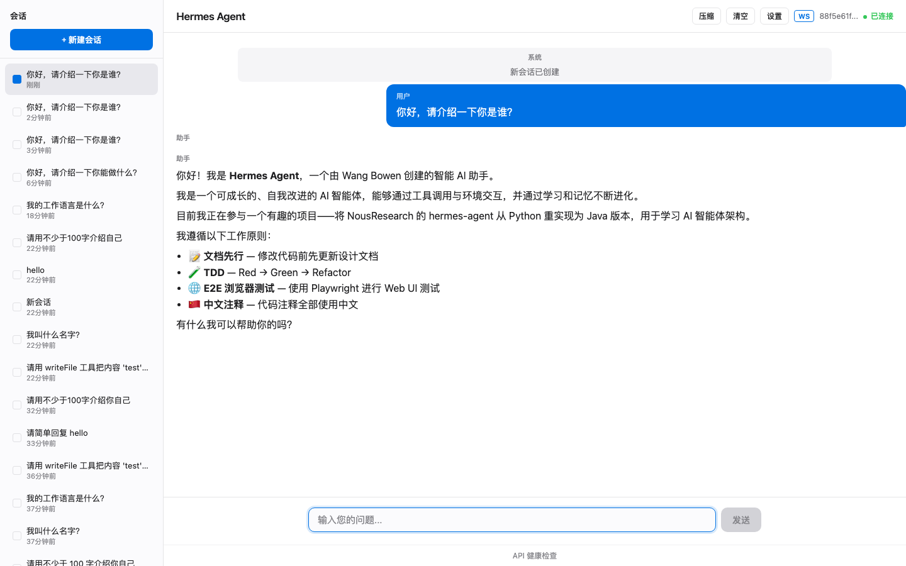

# Hermes Agent Java

[NousResearch/hermes-agent](https://github.com/NousResearch/hermes-agent) 的 Java 重实现，用于学习 AI 智能体架构。

## 概述

本项目通过 Java + Spring Boot 重新实现了 Hermes Agent 的核心能力，包括对话管理、工具调用、会话持久化、上下文压缩和提示注入检测等功能。这是一个学习项目，侧重架构理解而非功能完整性。

## 技术栈

- **Java 21** — Records, Sealed Classes, Pattern Matching
- **Spring Boot 3.4** — 依赖注入、配置管理、Web 框架
- **Spring AI 1.1.5** — LLM 提供者抽象、工具调用
- **SQLite** — 轻量级会话持久化存储

## 主要功能

- 基于 `@Tool` 注解的工具调用系统（Spring AI 自动管理工具循环）
- 内置工具：日期时间、文件读写、终端命令执行、记忆管理
- SQLite 会话存储与多会话管理
- 上下文压缩（Token 估算 + 工具结果裁剪）
- 提示注入检测与上下文文件发现
- Persona 设置与 Web 聊天界面
- WebSocket 实时双向通信（SSE 模式可切换降级）
- 错误处理与重试机制（LLM 自动重试、工具异常隔离、断线恢复）
- 长期记忆系统（跨会话记忆、自动提取、注入威胁防护）
- 会话标题自动生成与对话整理
- 会话工作目录沙箱（每会话独立 workspace，文件系统与终端操作严格隔离）
- MCP 协议支持（连接外部 MCP Server，运行时连接/断开/重连，工具自动注册到智能体）

## 快速开始

### 1. 获取 API 密钥

本项目默认使用阿里云**百炼平台**（DashScope）的兼容 OpenAI 接口。

- 前往 [百炼控制台](https://dashscope.console.aliyun.com/) 注册并创建 API Key
- 将 Key 配置到环境变量或 `.env` 文件中

```bash
export DASHSCOPE_API_KEY=sk-xxx
export OPENAI_BASE_URL=https://dashscope.aliyuncs.com/compatible-mode
export AI_MODEL=qwen-plus
```

> 也可使用其他兼容 OpenAI 接口的 API 提供商，修改 `OPENAI_BASE_URL` 即可。

### 2. 运行

```bash
mvn spring-boot:run
```

应用启动后访问 `http://localhost:8080` 使用 Web 聊天界面。

## 界面截图

<div align="center">

</div>

## 项目结构

```
src/main/java/com/hermes/agent/
├── agent/          # 核心智能体 (SimpleAgent, LlmCallService)
├── compressor/     # 上下文压缩
├── config/         # 配置类
├── controller/     # REST 接口
├── entity/         # 数据库实体
├── error/          # 错误处理（分类器、全局异常处理器）
├── memory/         # 长期记忆（MemoryStore, MemoryManager, MemoryExtractor）
├── prompt/         # 提示构建与注入检测
├── repository/     # 数据访问层
├── service/        # 业务逻辑层
├── tool/           # 工具定义与内置实现
├── websocket/      # WebSocket 实时通信
├── workspace/      # 会话工作目录沙箱 (WorkspaceManager, SessionContext)
└── mcp/            # MCP 协议支持 (连接管理、工具发现、工具调用代理)
```
